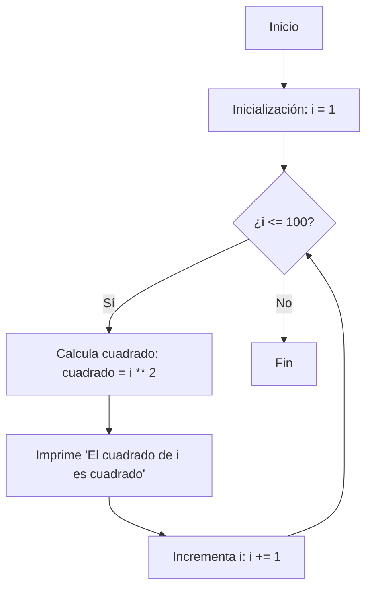
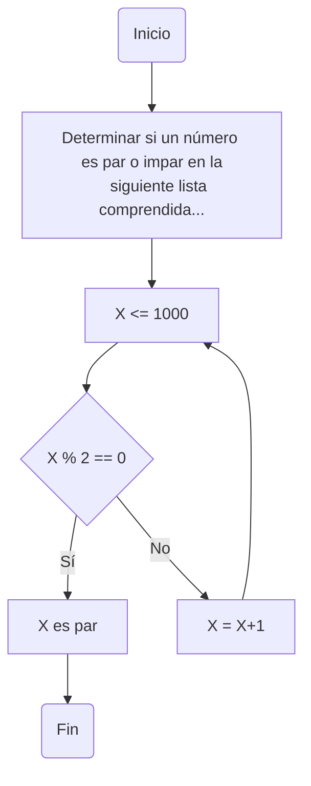
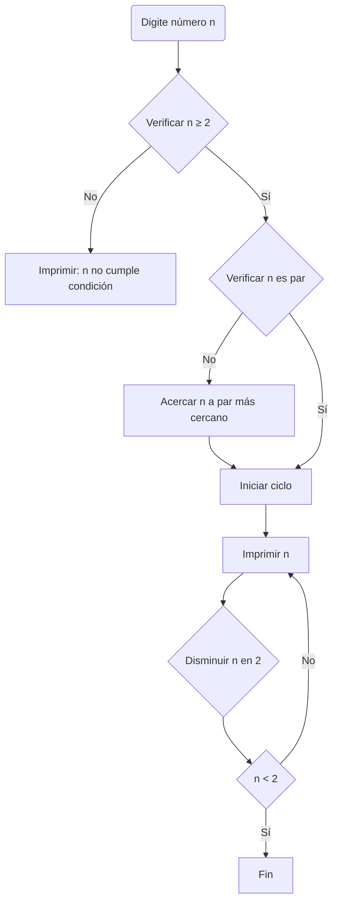

# Reto_07
1. Imprimir un listado con los números del 1 al 100 cada uno con su respectivo cuadrado.

```python
#Nombramos nuestra variable 
i = 1
#i es el listado de números del 1 al 100
while i <= 100:
#Mientras que i sea menor o igual que 100 se debe hallar su cuadrado a cada uno
    print(i, i ** 2)
    i += 1
```

2. Imprimir un listado con los números impares desde 1 hasta 999 y seguidamente otro listado con los números pares desde 2 hasta 1000.

```python
#Nombramos nuestra variable
x=1
#x es la lista de númers comprendidos entre 1 - 1000, estos se  deben dividir entre 2, si su residuo es 0, ese número es par mientras que por lo contrario es 1, el número es impar
while x <= 1000:
    if x % 2 == 0:
        print("El número ",x," es par")
    if x % 2 == 1:
        print("El número ",x," es impar")
    x += 1
print("Ciclo terminado")
```

3. Imprimir los números pares en forma descendente hasta 2 que son menores o iguales a un número natural n ≥ 2 dado

```python
#Le pedimos al usuario que digite el numero
n=int(input("Digite numero desde el cual descenderan los numeros primos siempre y cuando sea mayor o igual que 2: "))
#Nombramos nuestra variable i, si este es mayor que 2, le pedimos al programa que digite los numeros que su residuo sea 0 al dividir por 2 de manera ascendente
i = n
while i >= 2:
    i -= 1
    if i % 2 == 0:
       print(i)
```

4. En 2022 el país A tendrá una población de 25 millones de habitantes y el país B de 18.9 millones. Las tasas de crecimiento anual de la población serán de 2% y 3% respectivamente. Desarrollar un algoritmo para informar en que año la población del país B superará a la de A.

```python
#Nombramos los paises y les asignamos el numero de habitantes junto con declarar las tasas como variables
B = 18900000  
A = 25000000
tasa_A = 0.02  # 2%
tasa_B = 0.03  # 3%
año=int(input("Ingrese un año: "))
while B <= A:
    #Mientras que B sea mayor o igual en numero de habitantes, se seguira ejecutando el programa
    A *= (1 + tasa_A)
    B *= (1 + tasa_B)
    año += 1

print("La población del país B superará a la del país A en el año:", año)
```
5. Imprimir el factorial de un número natural n dado.

```python
#Le pedimos al usuario digitar un numero natural
x = int(input("Digite un número natural: "))
#Le damos valores a dos variables cuando x sea >= 0
if x >=0:
    a = 1
    b = 1
#Si a es <= x, decimos que b es b*a
    while a <= x:
        b = b * a
        a += 1
        print ("El factorial de ",x," es: ",b)
else:
    print("Digtaste un número fuera de los parámetros")
```
6. Implementar un algoritmo que permita adivinar un número dado de 1 a 100, preguntando en cada caso si el número es mayor, menor o igual.

```python
#Importamos de la libreria random
import random
#le ordenamos al prgrama que escoja un numero al azar en un rango definido
cualquierNumero = random.randrange (1,100)

def intro():
    print("Adivina el Número")
#Mostramos los intentos 
def juego():
    intentos = 0
#Le pedimos digitar cualquier numero al usuario
    while True:
        numeroDigitado = int(input("Digite un número entre el 1 y el 100"))
       # si el numero digitado es mayor al numero al azar le damos un tip al usuario diciendole que el número a hallar es mas pequeño
        if numeroDigitado > cualquierNumero:
            intentos += 1
            print("Creo que el numero es más pequeño")
       # si el numero digitado es mayor al numero al azar le damos un tip al usuario diciendole que el número a hallar es mas grande
        elif numeroDigitado < cualquierNumero:
            intentos += 1
            print("Tal vez el número sea mas grande")
      #Si no se cumple ninguna de estas 2 condiciones es que adivinaste el numero
        else:
            intentos +=1
            print(f"Enhorabuena, tu número es ",cualquierNumero )
            #rompemos el ciclo
            break
```
7. Implementar un programa que ingrese un número de 2 a 50 y muestre sus divisores.

```python
#declaramos nuestra variable i y le pedimos al usuario un numero
i = int(input("Digite un número entre 2 y 50: "))
#Condicionamos la variable i para que este en el rango ideal
if i < 2 or i > 50:
    print("El número digitado es inválido")
#Mostramos los divisores del numero digitado por n
else:
    print(f"Divisores de {i}:")
    for n in range(1, i + 1):
        if i % n == 0:
            print(n)
```
8. Implementar el algoritmo que muestre los números primos del 1 al 100. Nota: use funciones

```python
def es_primo(i):
    if i < 2:
        return False
    for n in range(2, int(i**0.5) + 1):
        if i % n == 0:
            return False
    return True

i = 1
while i <= 100:
    if es_primo(i):
        print(i)
    i += 1
```
